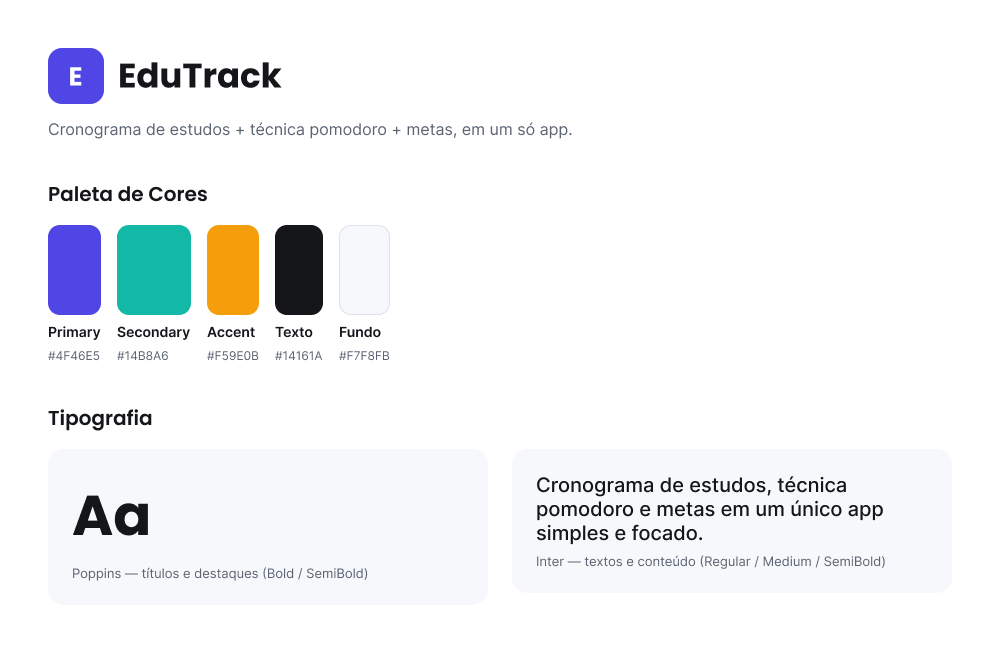
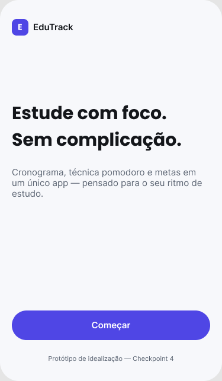
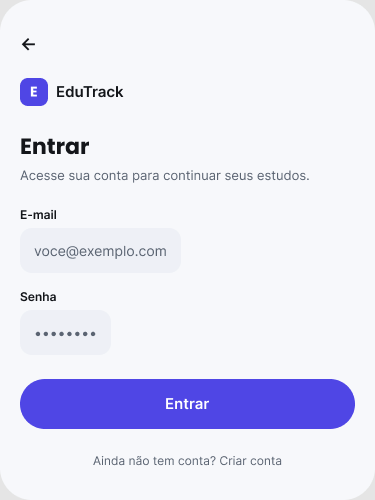
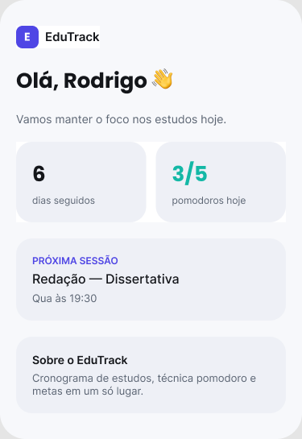
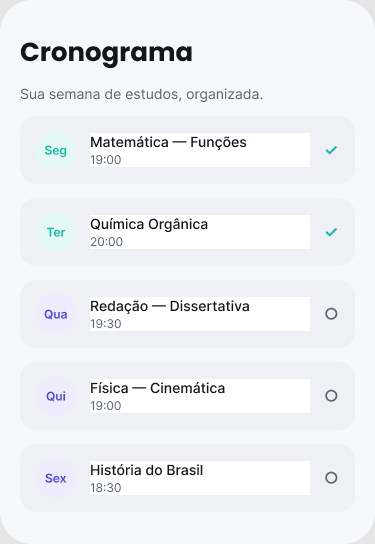
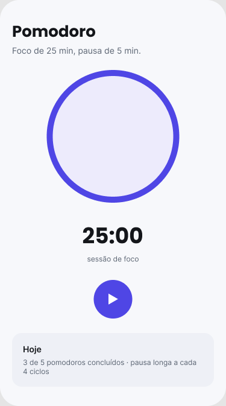

# Identidade Visual — EduTrack

## Nome

**EduTrack** — combina "Edu" (educação/estudo) com "Track" (acompanhar, trilhar), reforçando a
proposta central do app: acompanhar a jornada de estudos do usuário.

## Logo

Ícone (livro + gráfico de progresso + check) com o wordmark "EduTrack" em duas cores — "Edu" em
azul-marinho e "Track" em gradiente azul→roxo — reforçando os pilares de estudo (livro),
progresso (barras) e conclusão (check).

Arquivo usado no app em [`assets/images/logo.jpeg`](../assets/images/logo.jpeg), renderizado
pelo componente [`src/components/logo.tsx`](../src/components/logo.tsx) (versão compacta com
32px + wordmark em texto para cabeçalhos, versão grande de 160px para telas de entrada como o
Onboarding).

O style guide abaixo (paleta e tipografia) foi feito no Figma antes da entrega do logo final,
por isso ainda mostra um ícone genérico — as 14 telas na seção seguinte já usam o logo real.

Arquivo Figma (editável, com paleta, tipografia e as 14 telas): https://www.figma.com/design/DMtLARyrO0XZNoSm8z1IGk

## Paleta de cores

| Nome | Hex (light) | Uso |
| --- | --- | --- |
| Primary | `#4F46E5` | Ações principais, marca, links |
| Secondary | `#14B8A6` | Progresso positivo, concluído |
| Accent | `#F59E0B` | Destaques, metas, progresso |
| Texto | `#14161A` | Texto principal |
| Texto secundário | `#5B6472` | Texto de apoio |
| Fundo | `#F7F8FB` | Background das telas |
| Elemento | `#EEF0F6` | Cards e superfícies |

Os mesmos valores estão em código em [`src/constants/theme.ts`](../src/constants/theme.ts)
(inclui também as variantes para modo escuro).

## Tipografia

- **Poppins** (Bold / SemiBold) — títulos, wordmark e destaques. Fonte geométrica, moderna e
  amigável, transmitindo energia e foco.
- **Inter** (Regular / Medium / SemiBold) — textos e conteúdo. Fonte de alta legibilidade em
  telas pequenas, ideal para listas de cronograma e cards de dados.

## Telas do app

O EduTrack tem 14 telas, todas navegáveis como código funcional no app Expo (ver
[estrutura de pastas no README](../README.md#estrutura-de-pastas)) e todas com conceito visual
estático no Figma (importadas com o logo real, em 3 seções: "Telas 1", "Telas 2", "Telas 3").

| # | Tela | Descrição |
| --- | --- | --- |
| 1 | Onboarding | Boas-vindas, apresentação da proposta de valor |
| 2 | Login | Entrar na conta (mock, sem autenticação real ainda) |
| 3 | Criar conta | Cadastro (mock, sem autenticação real ainda) |
| 4 | Home / Dashboard | Saudação, streak, pomodoros do dia, próxima sessão |
| 5 | Cronograma | Lista da semana de estudos por matéria/dia/horário |
| 6 | Nova sessão de estudo | Formulário: matéria, dia da semana, horário |
| 7 | Pomodoro | Timer de foco/pausa |
| 8 | Metas | Progresso das metas de estudo |
| 9 | Nova meta | Formulário: título, meta de horas, descrição |
| 10 | Detalhe da Meta | Progresso detalhado, horas por semana, adicionar sessão |
| 11 | Perfil | Dados do usuário, streak, plano, configurações |
| 12 | Editar perfil | Alterar nome e e-mail |
| 13 | Notificações | Lembretes, progresso de metas, streak, novidades |
| 14 | Estatísticas | Horas totais/pomodoros, horas por matéria e por dia da semana |

Prints do Figma (telas conceituais, estáticas — versão anterior, sem o logo real):

| Onboarding | Login | Home |
| --- | --- | --- |
|  |  |  |

| Cronograma | Pomodoro |
| --- | --- |
|  |  |

> Nota: as 14 telas atuais no Figma (com o logo real) foram importadas via plugin
> [html.to.design](https://www.html.to.design/), diretamente do HTML/CSS que reflete os tokens
> de `src/constants/theme.ts`. Os prints acima são de uma versão anterior, construída direto
> pela API do Figma antes do logo definitivo — ficaram aqui só como referência histórica; para
> ver as telas atuais, abra o arquivo Figma linkado acima.
